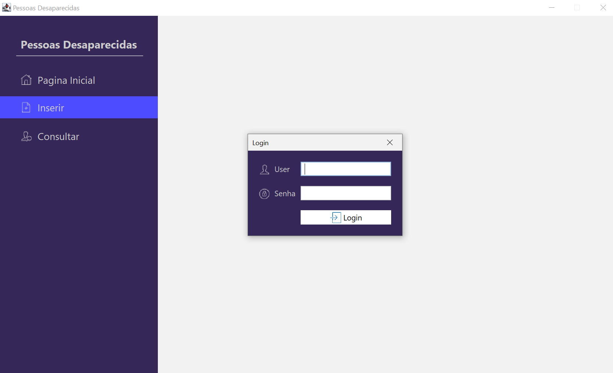
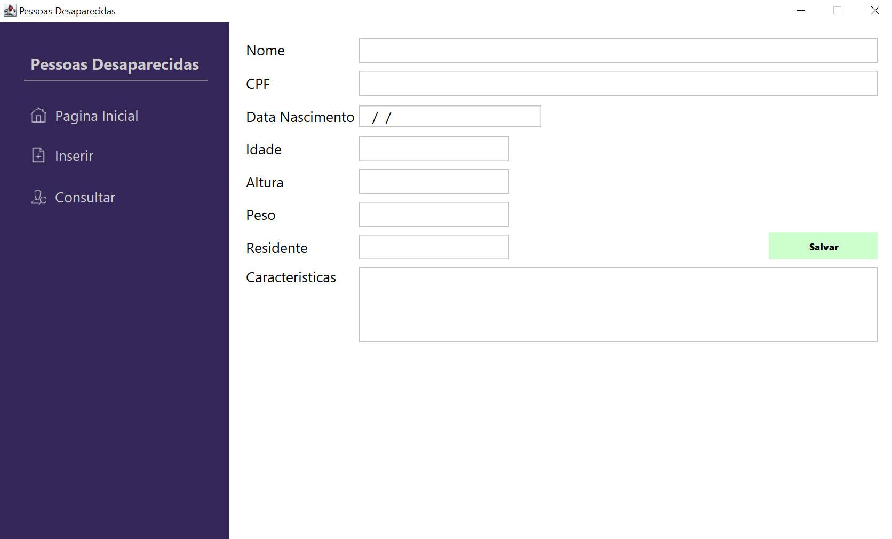
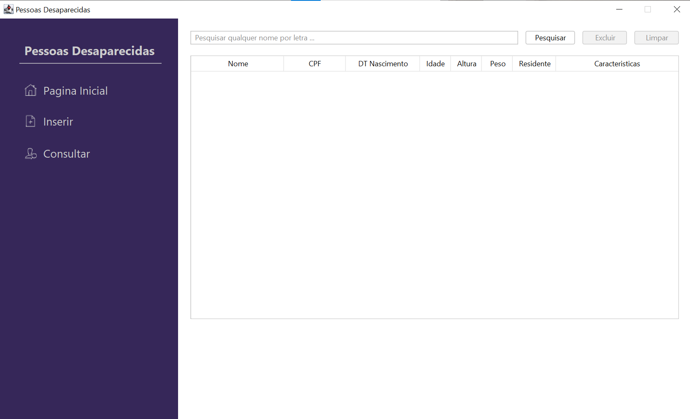

# TDS-PI-DESAPARECIDOS

<h1> Welcome Page </h1>

 On the first screen, the Home Page, the user will have access to the left side menu, with important accesses. On the right side space, the user will have access to useful links, helpful contacts, important recommendations and contacts with psychologist to get some pain relief from missing someone. 

<h1> Login Page </h1>

 When selecting the option to login, the user must add the registered credentials. These credentils will be unique to each user as they will be directly tied to the CPF. If the user have forgotten their password, they will face the process of password recovery. 

 The user must be logged in to register a missing or a found people, but will not require login to access the helpful links on the <b>Welcome Page</b>. 

<h1> Registering </h1>

 After the login, the user will have the opportunity to add the information about the missing beloved or the information about a founded person. 

 Some of these information are mandatory adn only one person cab be registered using the same documents. 

<h1> Data Base </h1>

 On this page, the user will get the information about the registered cases, with the most important information. Also, here the user will be able to select one person and define if it was founded or if have any new information about this missing person. 

